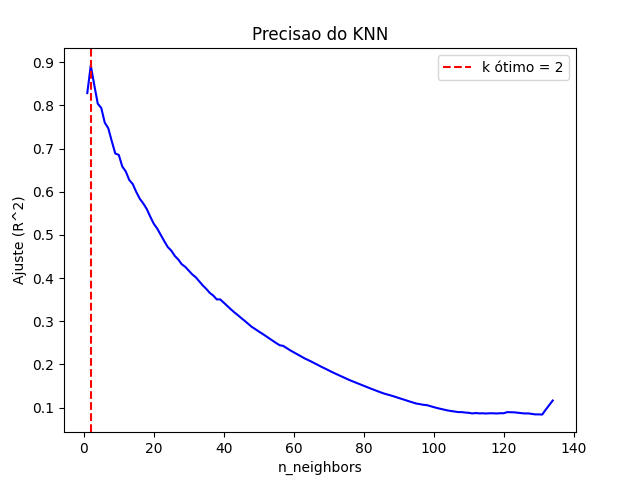

# KNN_regressao

Este projeto aplica o algoritmo de **K-Nearest Neighbors (KNN) para regressão** a fim de prever a quantidade de lixo gerado por países com base os dados: PIB, população, renda média e gastos públicos.

## 📂 Arquivos

- `projeto2.py` — Script principal com o pipeline de machine learning.
- `train_data.csv` — Conjunto de dados com os indicadores dos países.
- `Paises.png` — Gráfico da performance do modelo em função de `k`.

## ⚙️ O que o projeto faz

- Carrega e limpa os dados (removendo valores ausentes).
- Normaliza os dados com `StandardScaler`.
- Divide o conjunto em treino e teste.
- Testa todos os valores possíveis de `k` usando `KNeighborsRegressor` com `weights='distance'`.
- Calcula o **R²** para cada valor de `k` para encontrar o ponto ótimo.
- Gera gráfico visual com o melhor `k` e seu respectivo desempenho.

## 📈 Resultado

O modelo escolhe automaticamente o valor de `k` que maximiza o **coeficiente de determinação (R²)** — ou seja, o que melhor explica a variação nos dados de lixo gerado por país.

## 🛠️ Bibliotecas utilizadas

- `pandas`
- `numpy`
- `matplotlib`
- `seaborn`
- `scikit-learn`

